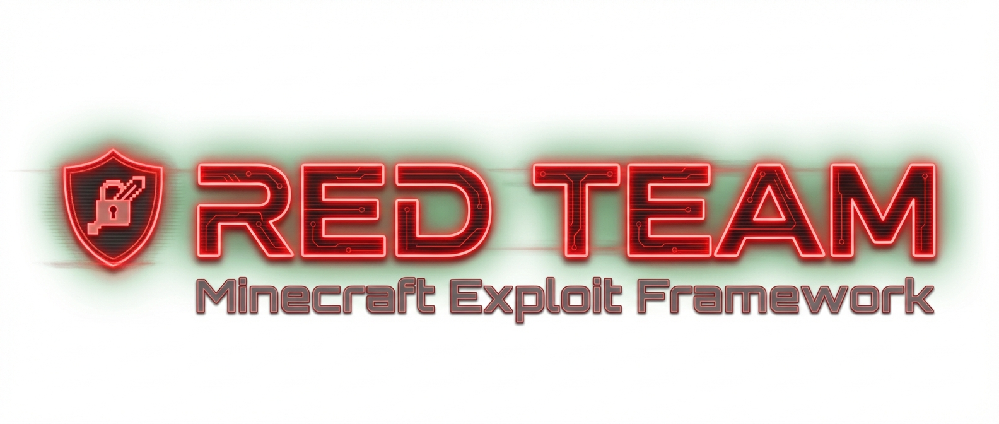
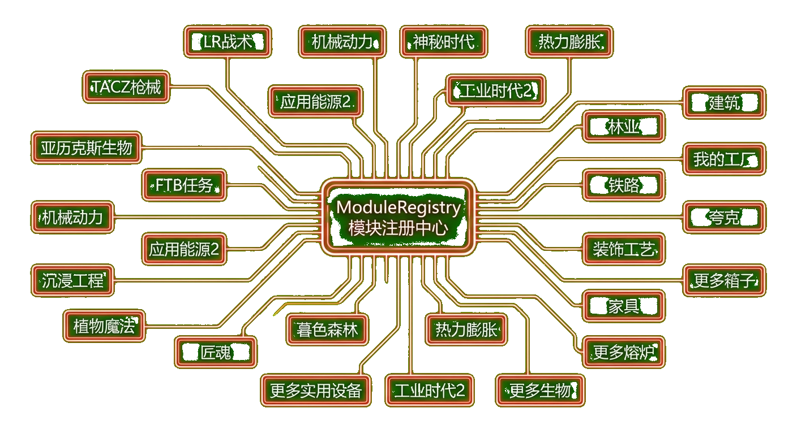
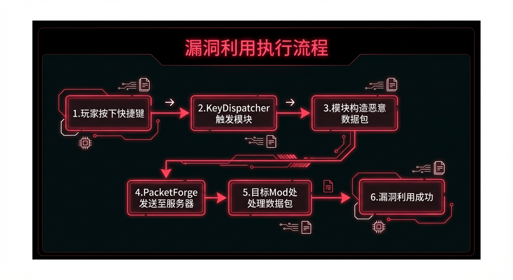
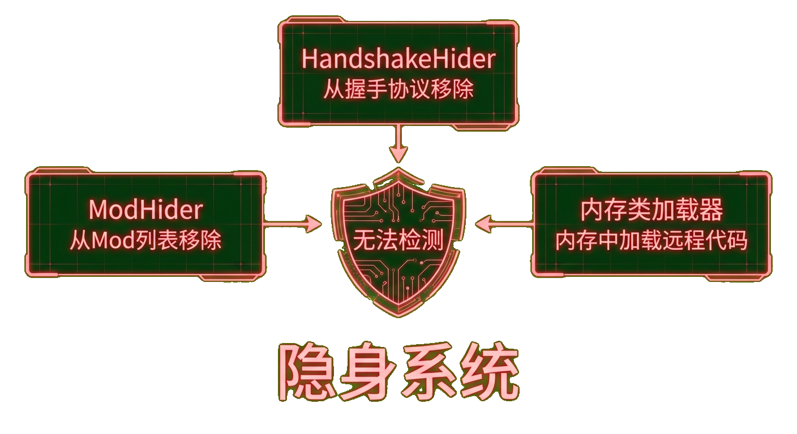
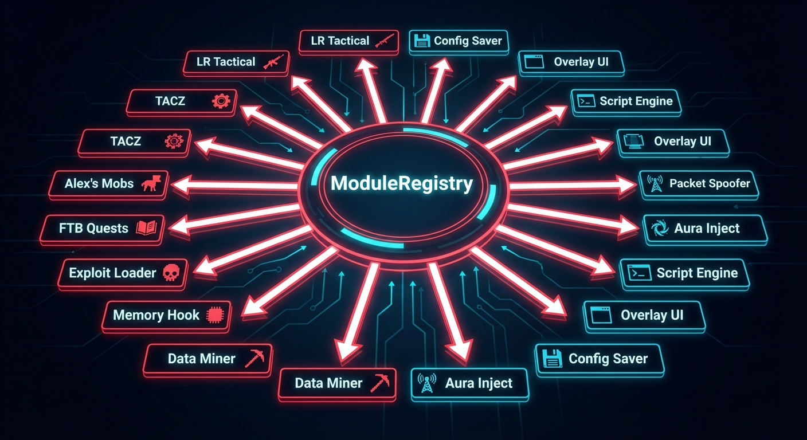
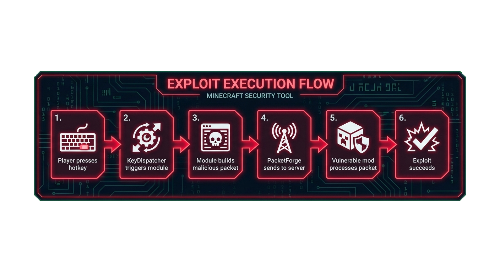
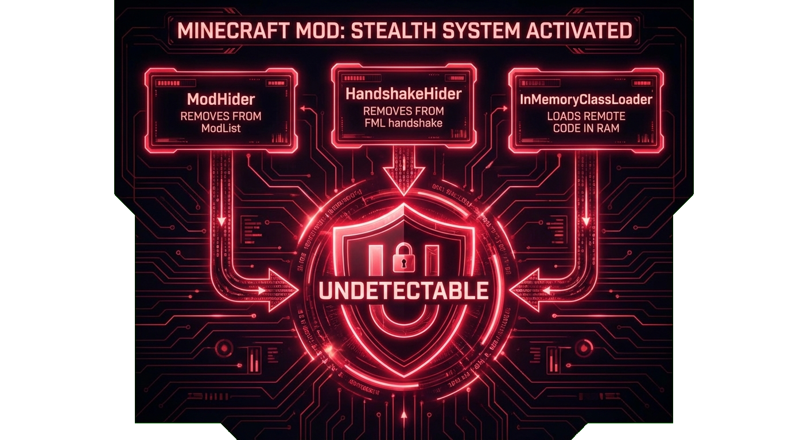

**中文** | [English](#english-version)

<div align="center">


# RED TEAM
**MINECRAFT MOD 漏洞利用框架 · 安全研究专用**

[](https://minecraft.net)
[](https://minecraftforge.net)
[](https://openjdk.org)
[](safe-protect/red/src/main/java/com/redblue/red/modules)

[功能特性](#-功能特性) · [工作原理](#-工作原理) · [漏洞模块](#-漏洞利用模块) · [快速开始](#-快速开始)
</div>

---

**RED TEAM** 是一个客户端 Minecraft Forge Mod，用于演示主流 Mod 生态中的安全漏洞。提供 100+ 模块化漏洞利用实现，覆盖 20+ 广泛使用的 Minecraft Mod，涉及缺失的服务端验证、速率限制绕过、NBT 注入、数据包伪造和 DoS 向量——通过简洁的 GUI、快捷键绑定和远程代码加载一键触发。

作者：**BlueDog**（2052774863）｜ 配套工具：`mc-mod-protocol-auditor` · `red-payload-builder`

## ✨ 功能特性

- **100+ 漏洞利用模块**，覆盖 20+ 主流 Minecraft Mod
- **模块化架构** — 每个漏洞利用均为独立可配置的 `AttackModule`
- **游戏内 GUI** — 分类网格、模块列表、动态配置界面、教程查看器
- **快捷键系统** — K 键打开菜单，Shift+1–0 绑定 10 个操作槽位
- **隐身层** — 运行时从 ModList、FML 握手和网络注册表中移除自身
- **远程模块加载** — 通过 `/rc load <token>` 在内存中下载并运行新漏洞利用
- **双模式数据包发送** — 原始 `ServerboundCustomPayloadPacket` + 反射回退
- **零配置文件** — 所有状态均在内存中，磁盘无痕迹
- **每模块参数** — 类型化配置（int、float、string、enum、item、entity），支持条件显示

## 🖼 工作原理

阶段一 — 模块架构

<div align="center"></div>

1. `RedMod` 在启动时将 100+ 内置 `AttackModule` 注册到 `ModuleRegistry`
2. 模块按目标 Mod 前缀分组（如 `lrt`、`tacz`、`ia`、`ftq`）
3. 每个模块声明自己的 `ConfigParam` 列表、可用性检查和执行逻辑
4. `ModuleRegistry` 提供按 ID 查找和按分类分组访问（供 GUI 使用）

阶段二 — 漏洞利用执行流程

<div align="center"></div>

1. 玩家按下 **K** 打开 GUI 或触发快捷键槽位（**Shift+1–0**）
2. `KeyDispatcher` 路由输入 — 打开 `RedMainScreen` 或调用 `module.execute()` / `module.tick()`
3. 模块构造针对目标 Mod 频道的恶意数据包载荷
4. `PacketForge` 发送数据包 — 优先原始模式，失败则反射回退
5. 服务端 Mod 未经验证处理数据包 → 漏洞利用成功

阶段三 — 隐身系统

<div align="center"></div>

1. 在 `FMLLoadCompleteEvent` 时，`HideOnLoad` 触发两个隐藏器
2. `ModHider` 通过反射从 Forge 的 `indexedMods`、`modFiles`、`sortedList` 等结构中移除本 Mod
3. `HandshakeHider` 清理 `NetworkRegistry.instances` 和 `NetworkRegistry.channels`
4. 远程模块通过 `InMemoryClassLoader` 加载 — 不写入磁盘，无文件痕迹

## 🎯 漏洞利用模块

| 分类 | 模块 | 漏洞类型 |
|---|---|---|
| LR Tactical | LRT01–LRT04 | KillAura、DoS、死亡利用 |
| TACZ 枪械 | TACZ01–TACZ02 | 配件复制、快速射击 |
| TACZ 附加 | TACZADD01–03 | 槽位交换、远程容器、崩溃 |
| Citadel | CTD01–CTD03 | 标签覆盖、NBT 膨胀 DoS、伪造 |
| Alex's Mobs | AM01–AM07 | 物品注入、传送、劫持、生物群系损坏 |
| Corpse | CORPSE01–03 | 死亡历史窥探、翻页崩溃、I/O 洪水 |
| KubeJS | KJS01–KJS03 | 数据注入、点击洪水、NBT 膨胀 |
| JourneyMap | JM01–JM05 | 传送、管理员配置读写、DoS |
| Open Parties & Claims | OPAC01–05 | 领地 DoS、同步洪水、内存压力 |
| CustomNPCs | CNPC01–07 | NBT 覆写、对话伪造、玩家数据清除 |
| Curios API | CURIOS01–02 | 销毁所有物品、渲染切换 |
| ParCool! | PCOOL01–03 | 无限耐力、动作伪造、DoS |
| Limitless Vehicle | LV01–LV06 | 载具劫持、炮兵滥用、远程合成 |
| Immersive Aircraft | IA01–IA06 | 速度注入、背包窥探、NaN 崩溃 |
| Cataclysm | CATA01–02 | 祭坛注入、竞态条件 DoS |
| FTB Quests | FTQ01–06 | 物品复制、任务破坏、结构泄露 |
| ExtinctionZ | EXT01–04 | 远程容器、背包 NBT 注入、绕过 |
| Simple Voice Chat | VC01–03 | 群组暴力破解、洪水 DoS、音频放大 |

## 🚀 快速开始

```bash
cd safe-protect/red
./gradlew build
# 输出：build/libs/redteam-1.0.0.jar
```

将 JAR 放入 Minecraft 1.20.1 + Forge 47.2.0 客户端 `mods/` 文件夹。

**游戏内控制：**
- `K` — 打开主菜单
- `Shift+1` 至 `Shift+0` — 触发绑定的快捷键槽位
- `/rc load <token>` — 加载远程漏洞利用模块
- `/rc unload` — 卸载远程模块

## 🛠 技术栈

| 组件 | 技术 |
|---|---|
| Minecraft | 1.20.1 |
| Mod 加载器 | Forge 47.2.0 |
| 语言 | Java 17 |
| 构建工具 | Gradle + ForgeGradle |
| 映射表 | Official (Mojang) |
| 数据包层 | Netty + Forge SimpleChannel |
| 类加载 | 自定义 InMemoryClassLoader |
| 远程加载 | Java ServiceLoader + Bearer 认证 |

---

<details>
<summary id="english-version">🌐 English Version</summary>

[中文](#) | **English**

<div align="center">


# RED TEAM
**MINECRAFT MOD EXPLOIT FRAMEWORK FOR SECURITY RESEARCH**

[](https://minecraft.net)
[](https://minecraftforge.net)
[](https://openjdk.org)
[](safe-protect/red/src/main/java/com/redblue/red/modules)
</div>

**RED TEAM** is a client-side Minecraft Forge mod demonstrating security vulnerabilities in popular mod ecosystems. 100+ modular exploits across 20+ mods — missing server-side validation, rate limiting bypasses, NBT injection, packet spoofing, and DoS vectors.

Author: **BlueDog** (2052774863) | Tools: `mc-mod-protocol-auditor` · `red-payload-builder`

### ✨ Features

- **100+ exploit modules** targeting 20+ popular Minecraft mods
- **Modular architecture** — each exploit is an independent, configurable `AttackModule`
- **In-game GUI** — category grid, module list, dynamic config screens, tutorial viewer
- **Hotkey system** — K to open menu, Shift+1–0 for 10 bindable action slots
- **Stealth layer** — removed from ModList, FML handshake, and network registry at runtime
- **Remote module loading** — download and run new exploits in-memory via `/rc load <token>`
- **Dual-mode packet sender** — raw `ServerboundCustomPayloadPacket` + reflection fallback
- **Zero config files** — all state is in-memory, no traces on disk

### 🖼 How It Works

Phase 1 — Module Architecture

<div align="center"></div>

1. `RedMod` registers all 100+ `AttackModule` implementations into `ModuleRegistry` at startup
2. Modules grouped by target mod prefix (`lrt`, `tacz`, `ia`, `ftq`, etc.)
3. Each module declares its own `ConfigParam` list, availability check, and execution logic
4. `ModuleRegistry` provides lookup by ID and category-grouped access for the GUI

Phase 2 — Exploit Execution Flow

<div align="center"></div>

1. Player opens GUI with **K** or triggers a hotkey slot (**Shift+1–0**)
2. `KeyDispatcher` routes input — opens `RedMainScreen` or calls `module.execute()` / `module.tick()`
3. Module constructs crafted packet payload targeting the vulnerable mod's channel
4. `PacketForge` sends the packet — raw mode first, reflection fallback if needed
5. Server-side mod processes packet without validation → exploit succeeds

Phase 3 — Stealth System

<div align="center"></div>

1. On `FMLLoadCompleteEvent`, `HideOnLoad` triggers both hiders
2. `ModHider` removes the mod from Forge's `indexedMods`, `modFiles`, `sortedList` via reflection
3. `HandshakeHider` cleans `NetworkRegistry.instances` and `NetworkRegistry.channels`
4. Remote modules load via `InMemoryClassLoader` — no JAR on disk, no file traces

### 🎯 Exploit Modules

| Category | Modules | Vulnerability Types |
|---|---|---|
| LR Tactical | LRT01–LRT04 | KillAura, DoS, death exploit |
| TACZ Firearms | TACZ01–TACZ02 | Attachment dupe, rapid fire |
| TACZ Addon | TACZADD01–03 | Slot swap, remote container, crash |
| Citadel | CTD01–CTD03 | Tag override, NBT bloat DoS, spoof |
| Alex's Mobs | AM01–AM07 | Item inject, teleport, hijack, biome corrupt |
| Corpse | CORPSE01–03 | Death history spy, page crash, I/O flood |
| KubeJS | KJS01–KJS03 | Data inject, click flood, NBT bloat |
| JourneyMap | JM01–JM05 | Teleport, admin config R/W, DoS |
| Open Parties & Claims | OPAC01–05 | Claim DoS, sync flood, memory pressure |
| CustomNPCs | CNPC01–07 | NBT overwrite, dialog forge, player data wipe |
| Curios API | CURIOS01–02 | Destroy all items, render toggle |
| ParCool! | PCOOL01–03 | Infinite stamina, action spoof, DoS |
| Limitless Vehicle | LV01–LV06 | Hijack, artillery abuse, remote craft |
| Immersive Aircraft | IA01–IA06 | Velocity inject, inventory spy, NaN crash |
| Cataclysm | CATA01–02 | Altar inject, race condition DoS |
| FTB Quests | FTQ01–06 | Item dupe, quest vandal, structure leak |
| ExtinctionZ | EXT01–04 | Remote container, backpack NBT inject, bypass |
| Simple Voice Chat | VC01–03 | Group brute force, flood DoS, audio amplify |

### 🚀 Quick Start

```bash
cd safe-protect/red
./gradlew build
# Output: build/libs/redteam-1.0.0.jar
```

Install into Minecraft 1.20.1 + Forge 47.2.0 client `mods/` folder.

**In-game controls:**
- `K` — open main menu
- `Shift+1` through `Shift+0` — trigger bound hotkey slots
- `/rc load <token>` — load remote exploit modules
- `/rc unload` — unload remote modules

### 🛠 Tech Stack

| Component | Technology |
|---|---|
| Minecraft | 1.20.1 |
| Mod Loader | Forge 47.2.0 |
| Language | Java 17 |
| Build | Gradle + ForgeGradle |
| Mappings | Official (Mojang) |
| Packet Layer | Netty + Forge SimpleChannel |
| Class Loading | Custom InMemoryClassLoader |
| Remote Loading | Java ServiceLoader + Bearer auth |

</details>
